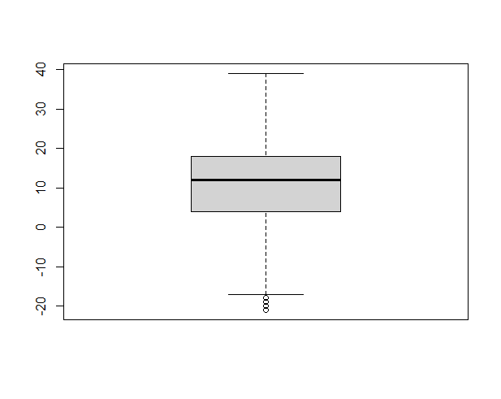

# Data Visualization

Data visualization of weather history dataset using R programming.

## Features

* Data Cleaning using Janitor Function and Mutate Function
* Visualization using GGPLOT2 Library

## Visual Representation

* Histogram

* Boxplot 

* Barplot

